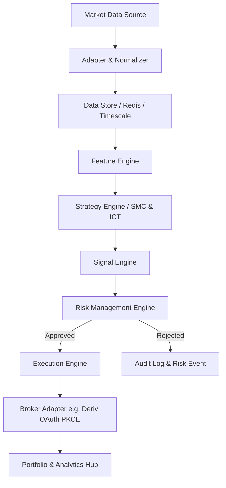

# AppExQuant Markets Global

> **Institutional Quantitative Technology Platform for Market Intelligence, Strategy, Risk, Execution, Analytics, and Automation.**

[]()
[](https://www.typescriptlang.org/)
[](#license-status)
[](#security)

---

## Overview

**AppExQuant Markets Global** is a professional-grade quantitative technology platform designed for advanced algorithmic trading, market structure analysis (SMC/ICT), automated execution, institutional risk management, and multi-asset portfolio analytics.

Built with a modular, broker-agnostic architecture, AppExQuant decouples raw market data processing, quantitative feature engineering, strategy generation, risk validation, and trade execution into isolated, testable domain pipelines.

---

## Core Architecture Pipeline



---

## Core Features

- **Institutional Market Intelligence**: Real-time tick and candle streaming, volatility analysis, and liquidity sweep detection.
- **Advanced Quantitative Strategies**: SMC (Smart Money Concepts) and ICT (Inner Circle Trader) algorithmic strategy frameworks.
- **Secure OAuth 2.0 PKCE Authentication**: Server-side session establishment integrated securely with Deriv broker accounts.
- **Multi-Environment Isolation**: Strict runtime separation between Backtesting, Paper Trading, and Live Execution.
- **Risk Management Firewall**: Centralized portfolio exposure checks, maximum drawdown limits, and automated circuit breakers.
- **Professional Developer Documentation**: Comprehensive technical manual and open-source architecture guide.

---

## Technology Stack

- **Frontend**: React 18+, TypeScript, Tailwind CSS, Lucide Icons, Recharts, Framer Motion.
- **Backend**: Node.js, Express, TypeScript, Web Crypto API.
- **Database**: PostgreSQL with connection pooling and automated migration runners.
- **Broker Integrations**: Deriv API (WebSocket & REST OAuth 2.0 PKCE).

---

## Quick Start

1. **Clone and Install Dependencies**:
   ```bash
   git clone https://github.com/appexquant/appexquant-markets-global.git
   cd appexquant-markets-global
   npm install
   ```

2. **Configure Environment Variables**:
   Copy `.env.example` to `.env` and fill in your credentials:
   ```bash
   cp .env.example .env
   ```

3. **Run Development Server**:
   ```bash
   npm run dev
   ```
   Open `http://localhost:3000` in your browser.

---

## Documentation

The complete technical manual is located in the [`docs/`](docs/) directory:
- [Platform Overview](docs/01-platform-overview.md)
- [System Architecture](docs/08-system-architecture.md)
- [Deriv Integration](docs/13-deriv-integration.md)
- [Quantitative Engine](docs/17-quantitative-engine.md)
- [Risk Engine](docs/21-risk-engine.md)
- [API Reference](docs/14-api-reference.md)

---

## Security

Please review our [Security Policy](SECURITY.md) before reporting vulnerabilities. Never expose API keys, database credentials, or OAuth secrets in client-side code or public issues.

---

## Contributing

We welcome institutional contributors, quantitative researchers, and systems engineers. Please read [CONTRIBUTING.md](CONTRIBUTING.md) and [CODE_OF_CONDUCT.md](CODE_OF_CONDUCT.md) before submitting pull requests.

---

## License Status

**License Status: Not Yet Decided**
AppExQuant Markets Global is currently proprietary software infrastructure. Public open-source licensing terms will be formalized prior to general availability.
