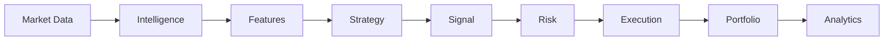

# 01. Platform Overview

AppExQuant Markets Global bridges the gap between institutional quantitative research and reliable retail/pro execution infrastructure.

## What is AppExQuant?

A unified trading and research platform providing real-time market data ingestion, algorithmic strategy generation (SMC/ICT), risk governance, and automated multi-asset order routing.

## Target Audience

- **Quantitative Researchers**: Developing and testing statistical and price-action models.
- **System Engineers**: Maintaining high-throughput execution pipelines and broker connectors.
- **Algorithmic Traders**: Deploying automated trading bots and Expert Advisors.

## Conceptual Architecture Flow

