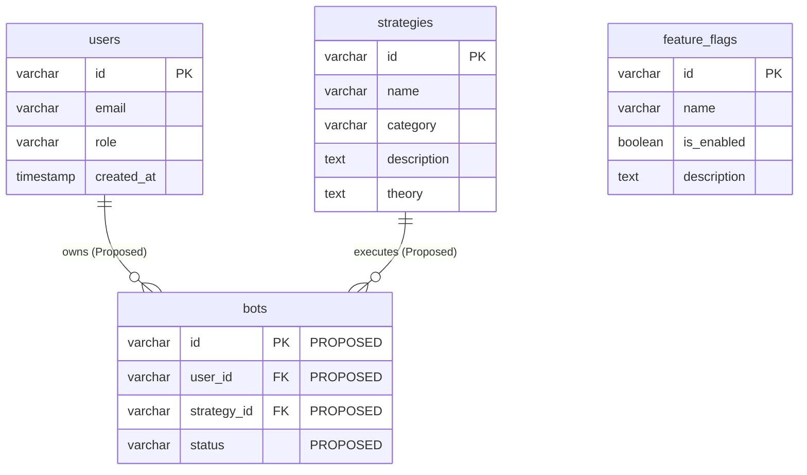

# 08. System Architecture

AppExQuant is built on a robust full-stack TypeScript architecture utilizing Express, Vite, React, and PostgreSQL, strictly separating verified core runtime components from proposed future quantitative execution modules.

## 1. High-Level System Topology

```mermaid
flowchart TD
    subgraph Client [Client Tier - Browser SPA]
        UI[React UI Dashboard & Charts]
        AuthGate[AuthGate & OAuth PKCE Client]
    end

    subgraph Ingress [Container Ingress]
        Proxy[Nginx Reverse Proxy - Port 3000]
    end

    subgraph Server [Backend Tier - Express Node.js Server]
        Vite[Vite Dev / Static Asset Middleware]
        API[API Routes /api/*]
        AuthSvc[OAuth 2.0 PKCE & Session Service [VERIFIED]]
        QuantEngine[Quantitative & Strategy Engine [PROPOSED]]
    end

    subgraph Storage [Persistence & External Tier]
        DB[(PostgreSQL Database Pool [VERIFIED])]
        Broker[Deriv OAuth & WebSocket API [VERIFIED]]
    end

    UI --> Proxy
    AuthGate --> Proxy
    Proxy --> Server
    Server --> Vite
    Server --> API
    API --> AuthSvc
    API --> QuantEngine
    AuthSvc --> DB
    AuthSvc --> Broker
    QuantEngine -.->|Future Integration| DB
    QuantEngine -.->|Future Integration| Broker
```

## 2. Frontend Architecture

```mermaid
flowchart TD
    subgraph Frontend [React SPA - App.tsx]
        Router[View State Router]
        AuthGate[AuthGate Component [VERIFIED]]
        Dash[Main Dashboard View]
        Markets[Markets & Charts View]
        Strategies[Strategies & SMC/ICT View]
        Bots[Automated Trading Bots View [PARTIAL]]
    end

    subgraph State & Hooks [State Management]
        GlobalState[React Context / App State]
        DerivAuth[useDerivAuth Hook [VERIFIED]]
    end

    Router --> AuthGate
    AuthGate -->|Authenticated| Dash
    Dash --> Markets
    Dash --> Strategies
    Dash --> Bots
    GlobalState --> AuthGate
    DerivAuth --> AuthGate
```

## 3. Backend Architecture

```mermaid
flowchart TD
    subgraph Backend [Express Server - server.ts]
        Middleware[Express JSON & Cookie Middleware]
        HealthRoute[GET /api/health [VERIFIED]]
        LoginRoute[GET /api/auth/deriv/login [VERIFIED]]
        CallbackRoute[GET /api/auth/deriv/callback [VERIFIED]]
        SessionRoute[GET /api/auth/session [VERIFIED]]
        BotRoutes[POST /api/bots/* [PROPOSED]]
    end

    subgraph Services [Service Layer]
        OAuthSvc[oauthServerService.ts [VERIFIED]]
        DBPool[db/connection.ts [VERIFIED]]
    end

    Middleware --> HealthRoute
    Middleware --> LoginRoute
    Middleware --> CallbackRoute
    Middleware --> SessionRoute
    Middleware --> BotRoutes

    LoginRoute --> OAuthSvc
    CallbackRoute --> OAuthSvc
    SessionRoute --> DBPool
    BotRoutes -.->|Proposed Execution| DBPool
```

## 4. Database Architecture



## Architectural Separation Summary

- **Verified & Implemented**: Express server routing, OAuth 2.0 PKCE Deriv login & callback flow, PostgreSQL connection pool, migration runner, and React dashboard UI.
- **Proposed Future Architecture**: Automated bot container runtimes, advanced quantitative strategy signal engines, and live multi-broker execution adapters.

