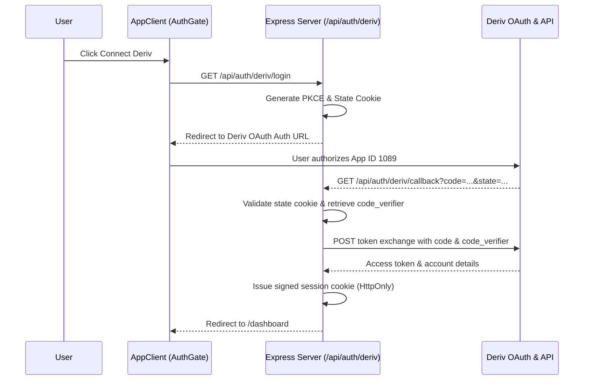

# 13. Deriv Broker Integration

AppExQuant integrates natively with Deriv via OAuth 2.0 PKCE and WebSocket market data feeds.

## Authentication Flow (OAuth 2.0 PKCE)

1. **User Initiation**: User clicks "Connect Deriv" in `AuthGate.tsx`.
2. **Server Login Route**: `/api/auth/deriv/login` generates cryptographic `code_verifier`, `code_challenge`, and `state`, storing state in an HttpOnly cookie and redirecting to Deriv OAuth.
3. **Authorization Callback**: `/api/auth/deriv/callback` validates the state, exchanges the authorization code via server-to-server POST request for access tokens, and establishes the application session token (`session_token`).

