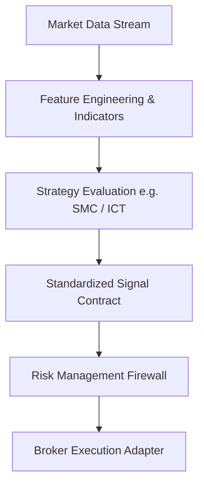

# 17. Quantitative Engine

The AppExQuant Quantitative Engine provides a modular pipeline for raw market data normalization, feature extraction, strategy evaluation, signal generation, and risk validation.

## Pipeline Architecture

## Core Principles

- **Broker Independence**: Strategies process standardized candles and ticks, remaining agnostic to the underlying broker (Deriv, Interactive Brokers, etc.).
- **Signal Serialization**: Signals output standardized structures consumable by UI dashboards, automated trading bots, and paper trading simulators.
