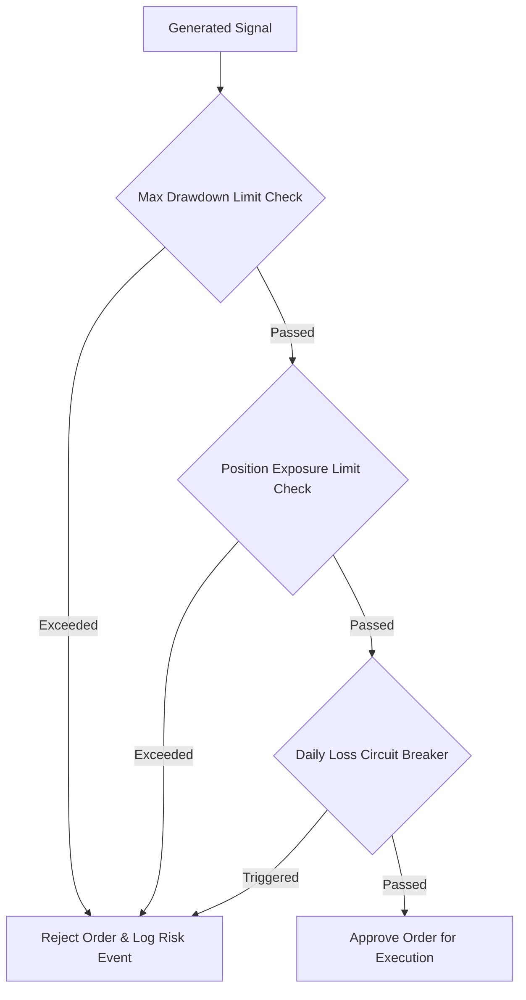

# 21. Risk Management Engine

The Risk Management Engine acts as an mandatory security firewall between generated trading signals and broker order execution.

## Risk Control Flow

## Enforced Controls

- **Position Sizing**: Automatically clamps leverage and order volume against available account equity.
- **Maximum Drawdown Protection**: Halts all automated strategy execution if portfolio drawdown crosses institutional thresholds.
- **Circuit Breakers**: Immediate manual or programmatic kill-switch capability across all active bots.
